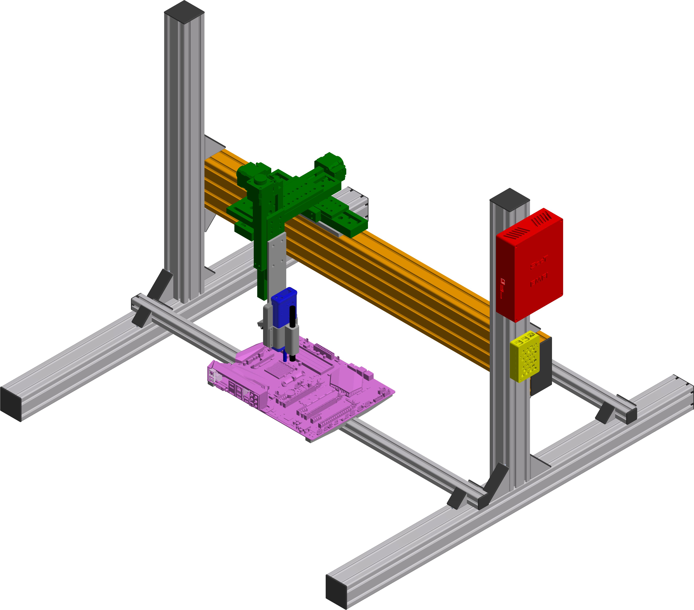

# Hardware
The *EMFI Station* hardware is built out of commercially available as well as 3D-printable parts. Aluminum construction
profiles are used as a base frame for the other components:

    

The following parts are commercially available:

- 1x [ChipShouter](https://www.newae.com/products/NAE-CW520)
- 3x [Standa 8MT175-100](https://www.standa.lt/products/catalog/motorised_positioners?item=60&prod=motorized_linear_stages)
- 3x [TMC2209 Stepper Driver](https://biqu.equipment/collections/driver-board/products/bigtreetech-tmc2209-stepper-motor-driver-for-3d-printer-board-vs-tmc2208)
- 1x [Bigtreetech SKR Pro v1.2](https://biqu.equipment/collections/control-board/products/bigtreetech-skr-pro-v1-1-32-bit-control-board?variant=29207358865506)
- 1x [Raspberry Pi 3B+](https://www.raspberrypi.com/products/raspberry-pi-3-model-b-plus/)
- 1x [Adafruit MLX90640 Thermal Camera](https://www.adafruit.com/product/4469)
- 1x [USB Microscope B007](https://www.supereyes-store.com/collections/microscopes/products/b007-300x-handheld-usb-digital-microscope-loupe-otoscope-magnifier-with-led-metal-stand)
- 1x [USB Microscope](https://www.amazon.de/TOOLCRAFT-Mikroskop-Pixel-Digitale-Vergr%C3%B6%C3%9Ferung/dp/B07L8M5BDJ)
- 1x [Power Supply](http://www.leicke.eu/de/products/NT03244)
- 1x [Angle Bracket](https://www.edmundoptics.de/p/metric-type-small-size-right-angle-bracket/12228/)
- 1x Aluminum Adapter Plates

All parts are mounted on an aluminum frame consisting of aluminum construction profiles. Please select these based on 
your needs. We used the following parts to achieve a working area large enough to target desktop and server hardware:

- 1x [12x6x100cm Profile](https://www.item24.com/en-de/profile-6-120x60-light-natural-41910/)
- 2x [6x6x100cm Profile](https://www.item24.com/en-de/profile-6-60x60-light-natural-41909/)
- 2x [3x3x100cm Profile](https://www.item24.com/en-de/profile-6-30x30-light-natural-41906/)
- 2x [6x6x70cm Profile](https://www.item24.com/en-de/profile-6-60x60-light-natural-41909/)
- 8x [6x6cm Angle](https://www.item24.com/en-de/angle-bracket-set-6-60x60-41968/)
- 8x [3x3cm Angle](https://www.item24.com/en-de/angle-bracket-set-6-30x30-41967/)
- Some [T-slot nuts](https://www.item24.com/en-de/t-slot-nut-f-6-st-m4-bright-zinc-plated-61323/)
- Some screws

Next to the commercially available parts, we 3D-printed mounts, cases and adapters. To allow an easy assembly, 
[threaded inserts](https://www.ruthex.de/collections/gewindeeinsatze) were used whenever threads were necessary in a 
3D-printed part. This folder contains all design (Autodesk Inventor (\*.ipt)) and print files (*.stl, *.stp):

- `skr_pro_case/` - Bigtreetech SKR Pro Case
- `ir_camera_mount/` - Thermal Camera Mount
- `chipshouter_mount/` - ChipShouter and Microscope Mount
- `atx_mount/` - ATX Mainboard Mount

Two aluminum adapter plates were specially produced based on our design. You can find the adapter plate design files 
in `adapter_plates/`.
